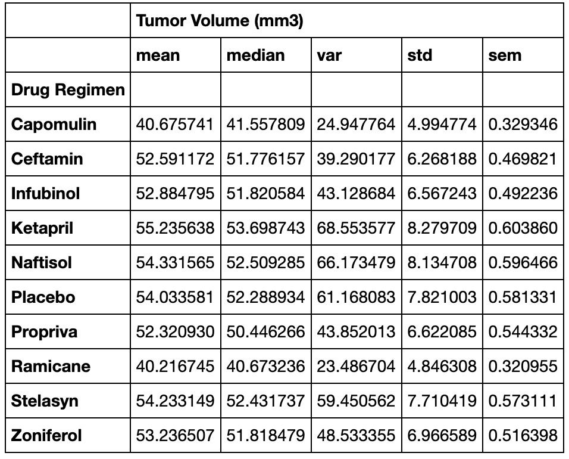
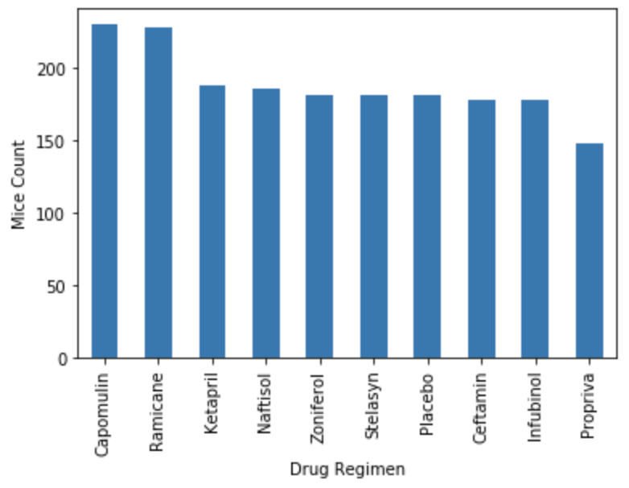
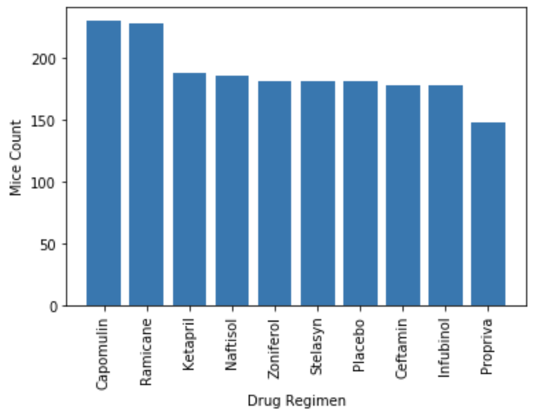
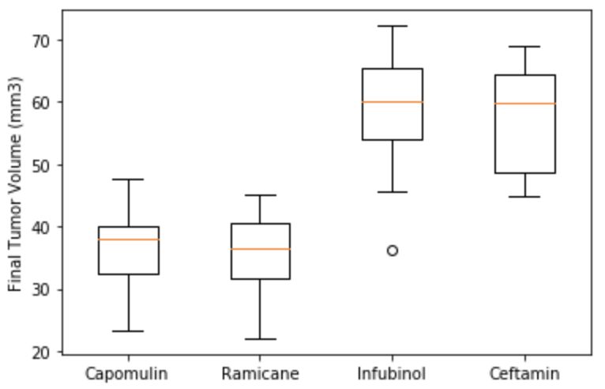
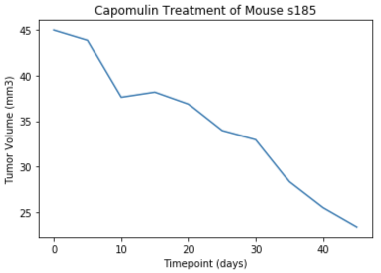
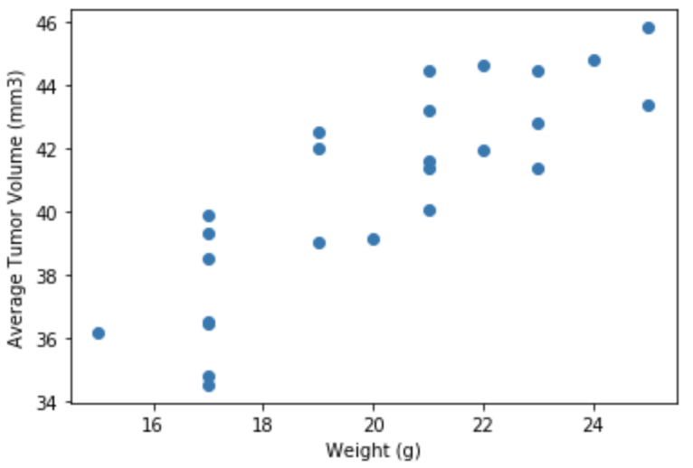
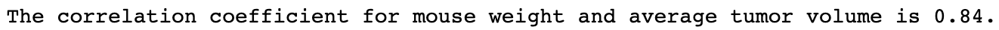
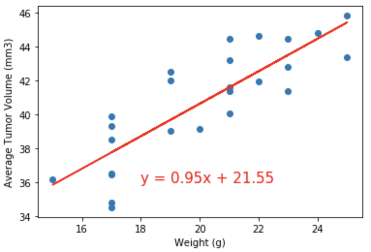

# Efficacy of Capomulin Cancer Treatment Drug - Matplotlib Analysis 

  

 
---

## Summary ##

Pymaceuticals, a burgeoning pharmaceutical company based out of San Diego, specializes in anti-cancer treatments. In its most recent animal study, it began screening for potential treatments for squamous cell carcinoma (SCC), a commonly occuring form of skin cancer. 249 mice identified with SCC tumor growth were treated through a variety of drug regimens. Over the course of 45 days, tumor development was observed and measured. The study compared the performance of Pymaceuticals' drug of interest, Capomulin, versus the other treatment regimens. 

This project uses Python Pandas to read the CSV data files into DataFrames and Matplotlib to produce all of the tables and figures needed to visualize the results of the study, in addition to a written summary.

---

## Process ##
* Initially checked the data for any mouse ID with duplicate time points and remove any data associated with that mouse ID.
### Summary Statistics
* Generated a summary statistics table consisting of the mean, median, variance, standard deviation, and SEM of the tumor volume for each drug regimen.

  

### Bar and Pie Charts
* Generated a bar plot using both Pandas's `DataFrame.plot()` and Matplotlib's `pyplot` that shows the number of total mice for each treatment regimen throughout the course of the study.

  

* Generated a pie plot using both Pandas's `DataFrame.plot()` and Matplotlib's `pyplot` that shows the distribution of female or male mice in the study.

  

### Quartiles, Outliers, and Boxplots
* Calculated the final tumor volume of each mouse across four of the most promising treatment regimens: Capomulin, Ramicane, Infubinol, and Ceftamin. 
* Calculated the quartiles and IQR and quantitatively determine if there are any potential outliers across all four treatment regimens.
* Used Matplotlib to generate a box and whisker plot of the final tumor volume for all four treatment regimens and highlight any potential outliers in the plot by changing their color and style. Plotted all four treatment regimens within the same figure.

  

### Line and Scatter Plots
* Selected "Mouse s185" that was treated with Capomulin and generate a line plot of time point versus tumor volume for that mouse.

  

* Generated a scatter plot of mouse weight versus average tumor volume for the Capomulin treatment regimen.

  

### Correlation and Regression
* Calculated the correlation coefficient and linear regression model between mouse weight and average tumor volume for the Capomulin treatment. Plot the linear regression model on top of the previous scatter plot.

  

  

---

## Conclusions ##

Visualizing the data in the figures below helps to illustrate the efficacy of the drug Capomulin at reducing the growth of SCC tumors. During the study's 45 day timeframe, the Capomulin treatment group incurred less mice deaths than the other groups, with the exception of the Ramicane group. The Capomulin group also completed the study with, on average, lower tumor volumes (mm3) than the other groups, again with the exception of the Ramicane group which nearly mirrored the final tumor volumes of the Capomulin mice. When the average tumor volume (mm3) of "Mouse s185" was measured over the course of the study, the tumor consistently reduced in size as the mouse received the Capomulin drug. Finally, the average tumor volume (mm3) of the Capomulin mice correlated strongly with their weight.

---

## References ##
* https://matplotlib.org/gallery/pyplots/boxplot_demo_pyplot.html#sphx-glr-gallery-pyplots-boxplot-demo-pyplot-py

---

## Technologies Used ##
* Python - Pandas, Matplotlib, SciPy.stats

---

## Author ##
Kiran Rangaraj - 2021
* LinkedIn: [@Kiran Rangaraj](https://www.linkedin.com/in/kiranrangaraj/)
